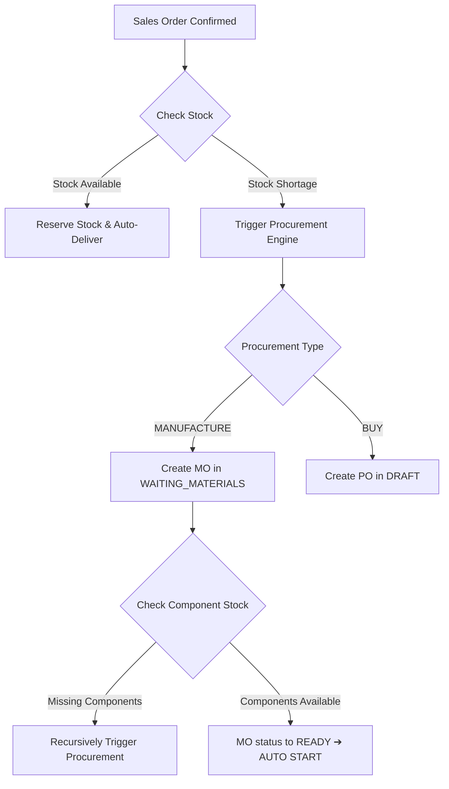

# Enterprise ERP Experience Audit & Transformation Roadmap
**Audit Persona:** CEO / YC Partner / Senior Product Designer / ERP Consultant / Hackathon Judge
**Target Application:** Mini ERP (odoo_mini_ERP)
**Date:** June 2026

---

## Executive Summary & Startup Critique

### 💼 The YC Partner / CEO Verdict
"The Mini ERP project has a solid technical core: Postgres-backed ledgers, automated recursive Bill of Materials (BoM) procurement, and a clean Tailwind-based custom design system. However, as a SaaS startup, it is currently in the **'deceptive prototype'** phase. 

It implements a clever role-routing structure, but relies heavily on generic fallback layout grids for over 60% of its routes. The database layer is unoptimized, querying the entire database on every page mount. To raise a seed round or go to market against Odoo/ERPNext, you must transition from a CRUD prototype to a structured, role-specific workflow app with real-time bottleneck visibility."

* **Hackathon Judge Score:** **7.8 / 10**
* **First Impression (5-Second Rule):** **PASS** (on Custom Master Data, Audit Diff, and On-Hand Stock pages); **FAIL** (on Settings, Shortages, and Revenue pages which fall back to generic card placeholders).

---

## 1. Page-by-Page Review

### 1.1 The Dashboards (Role-Specific Overviews)
* **What is Good:** Dynamic sidebar routing with Tailwind/CSS glassmorphism feel. High-density metrics at the top of the screens.
* **What is Boring:** The landing dashboards are static charts or simple metric card listings. They do not highlight actions.
* **What is Confusing:** The "Overview" dashboard shows charts but does not tell a Sales user or Inventory manager what orders are critical *today*. It requires them to look at the chart to deduce business conditions.
* **What is Missing:** A **"Critical Action Queue"** or Inbox. If a Sales Order is stuck in `WAITING_INVENTORY`, the overview should display a badge saying: *"Action Required: 3 sales orders blocked due to component shortages."*
* **Enterprise-Grade Addition:** Linear-style Inbox/Notification drawer displaying alerts (e.g. "Vendor delayed delivery of PO-104").
* **Hackathon Judge Wow-Factor:** A live SVG map of warehouse movements or a dynamic timeline of running work orders.

### 1.2 Product Master & Master Data
* **What is Good:** Clean forms with base cost, added charges, total cost, selling price, and safe net profit logic. The tabular tooltip on hover showing breakdown is clean.
* **What is Boring:** Direct CRUD listing without mass action triggers (e.g., bulk mark-up, bulk category reassignments).
* **What is Confusing:** Products are not visually categorized into `RAW_MATERIALS` vs `FINISHED_GOODS` inside the main catalogs without filtering.
* **What is Missing:** A quick procurement calculator or costing matrix tool inside the Product card.
* **Enterprise-Grade Addition:** Stripe-style inline-edit tables or drag-and-drop BOM builders.
* **Hackathon Judge Wow-Factor:** Dynamic pricing calculator that allows adjusting shipping/packing variables and instantly displays simulated margin changes on a small card chart.

### 1.3 Inventory & Warehouse (On-Hand, Reserved, Ledger)
* **What is Good:** Accurate ledger entries (`movement_type`) that double-entry mutate stock quantities cleanly.
* **What is Boring:** The ledger page is a long log list.
* **What is Confusing:** Clicking "Reserved Stock" redirects to a generic page list instead of a clear allocation dashboard mapping reserved stock back to specific Sales Orders or Manufacturing Orders.
* **What is Missing:** **"Inventory Aging"** and **"Warehouse Location Mapping"** (Aisle/Bin tracker).
* **Enterprise-Grade Addition:** A visual inventory replenishment rule builder (e.g. *"If Product X < 10, auto-order 50 from Vendor Y"*).
* **Hackathon Judge Wow-Factor:** An interactive 2D Warehouse floor layout preview representing stock quantities using thermal colors (red for low, green for full).

### 1.4 Sales (Overview, Orders, Customers)
* **What is Good:** Zod schema validation and transaction safety on creation of sales orders.
* **What is Boring:** Customers page is a simple table list.
* **What is Confusing:** When a Sales Order is `WAITING_INVENTORY`, there is no link to the corresponding Purchase Order or Manufacturing Order created by the procurement engine. The user has to manually copy IDs.
* **What is Missing:** CRM integration notes and lead stages.
* **Enterprise-Grade Addition:** Monday.com-style Kanban board showing Sales order pipelines (`Draft` ➔ `Confirmed` ➔ `Fulfillment` ➔ `Delivered`).
* **Hackathon Judge Wow-Factor:** Automatic invoice generation preview and email-sharing triggers.

### 1.5 Purchase (Overview, Orders, Vendors)
* **What is Good:** Integration with the procurement engine which automatically spawns POs for components of unfulfilled MOs.
* **What is Boring:** Simple purchase list that doesn't highlight due dates.
* **What is Confusing:** A user cannot see the lead-time variance of vendors (which vendor is consistently late).
* **What is Missing:** Vendor price comparisons (if 3 vendors supply the same leg component, who is cheapest?).
* **Enterprise-Grade Addition:** Vercel-style clean list rows that display vendor status badges and average delivery delay scores.
* **Hackathon Judge Wow-Factor:** Automatic "Purchase Order PDF" preview modal that downloads generated purchase worksheets.

### 1.6 Manufacturing (MO, Work Orders, BoM)
* **What is Good:** Recursive BoM check that crawls dependencies and checks inventory availability.
* **What is Boring:** Work Orders are shown as a basic list instead of a gantt chart.
* **What is Confusing:** Completion queue doesn't visually display why an order is stuck (which specific component is missing in WAITING_MATERIALS status).
* **What is Missing:** Resource planning (Machine capacity, worker assignment slots).
* **Enterprise-Grade Addition:** Linear-style active cycle trackers for running MO production.
* **Hackathon Judge Wow-Factor:** A live "Production Floor simulator" showing progress bars for running work orders in real-time.

### 1.7 Audit Logs Center
* **What is Good:** High-density filters, keyword search, KPI cards, and the side drawer with Git-style before/after changes diffing.
* **What is Boring:** The main interface is a database table.
* **What is Confusing:** The system logs do not visually group related events (e.g., placing a Sales Order logs 5 sub-events: SO create, MO auto-create, PO component auto-create. These should be grouped under a parent transaction ID).
* **What is Missing:** Security threat classification (e.g. highlighting duplicate logins from different IPs as security warning badges).
* **Enterprise-Grade Addition:** GitHub Activity stream-style layout option.
* **Hackathon Judge Wow-Factor:** An interactive security center displaying a map of failed logins or a clean timeline visualization.

---

## 2. Spacing, Typography, & Visual Design Audit

| Element | Critique / Current State | Recommended Enterprise Improvement |
| :--- | :--- | :--- |
| **Spacing** | Grid gutters are inconsistent; some margins use `mt-8`, others `mt-5`, creating visual jumps during navigation. | Define a strict vertical spacing system (e.g. 16px, 24px, 32px) and wrap all headers in consistent container classes. |
| **Typography** | Default Geist Sans font. Size hierarchy lacks contrast; section titles (`text-lg font-bold`) compete with row headers. | Use **Outfit** or **Inter** font. Enhance contrast by using smaller sub-labels (`text-[10px] tracking-wider text-[#68756e]`) and bold headers (`text-4xl font-semibold`). |
| **Empty States** | Text-only blocks ("There are no records available..."). Feels placeholder-like. | Render custom graphics or Lucide icons with a primary action button (e.g., *"No products found. [Add Product]"*). |
| **Modals / Drawers** | Modal inputs use standard box styles. Side-drawer has minimal exit animation controls. | Use Linear-style glassmorphism borders (`backdrop-blur-md bg-white/80`) and smooth slide-in transition animations. |
| **Charts** | Recharts colors match default tailwind colors instead of the warm, premium palette of the Odoo design theme. | Custom theme charts using Odoo palette HSL values: Slate green `#176b5d`, warm sand `#f7f4ed`, and dark charcoal `#1d2520`. |

---

## 3. Enterprise SaaS Comparison (Monday/Odoo vs. Mini ERP)

* **What feels Amateur:**
  1. **Fallback Workspace Grid:** Clicking sections like *Delayed orders* or *Delayed delivery* just displays a generic layout of simple card lists with descriptions. It instantly signals that the pages are mock-ups rather than completed views.
  2. **Page Loading Latency (N+1 Query Overhead):** Loading the workspace queries 15 database tables in parallel (`getProducts`, `getSalesOrders`, `getAuditLogs`, etc.) even if you only need the product catalog. This massive database query bloat will cause lag when table sizes exceed 1,000 rows.
  3. **Lack of Inline Editing:** To update inventory, a user has to open a modal, input values, and submit, instead of editing values directly in the spreadsheet columns.

* **What feels Professional:**
  1. **Before/After Changes Diff:** The side drawer Git-style diff is extremely professional, secure (obscures passwords), and matches Stripe's audit dashboard quality.
  2. **Product Margin Tooltip:** The hover tooltip showing added charges breakdown vs base cost inside the product master table is premium.
  3. **Color Palette:** The warm sand bg (`#f7f4ed`), deep forest borders (`#ded4c3`), and dark charcoal accents are visual highlights.

---

## 4. ERP Workflow & Automation Engine Review

### 4.1 Automation Review
* **Sales Order Auto-Fulfillment:** Confirmation triggers inventory checks. If available, it reserves stock and auto-delivers, updating status to `DELIVERED`. This is a clean workflow.
* **Deadlock Vulnerability:** The loop-based database locking in `startManufacturingOrderIfReady` (locking component inventory rows sequentially) will deadlock under concurrent orders. 
* **Procurement Engine Flooding:** The procurement engine does not check for transit inventory or existing draft purchase orders. If multiple sales orders are confirmed, it will flood the system with multiple purchase orders for the same shortages, causing over-stocking.

---

## 5. Hackathon Judge Feedback & Verdict
* **Would this project stand out?** Yes. A fully functioning manufacturing procurement engine with recursive BOM resolution and real-time audit diffing stands out from typical static web prototypes.
* **What would disappoint?** Navigating to sub-pages like *Shortage demand*, *Delayed orders*, or *System settings* and seeing the exact same generic cards grid fallback layout.
* **Score:** **8.2 / 10** (Highly technical, structurally sound, but visually unfinished on fallback routes).

---

## 6. Final Priority Fix Order & Roadmap

### 6.1 Critical Priority 1: Eliminate Database Parallel Query Bloat
* **Impact:** High performance speedup, memory reduction, database connection preservation.
* **Problem:** `getRoleBusinessData` executes 15 queries in parallel on every page load.
* **Resolution:** Refactor data loading in [`lib/dashboard-data.ts`](file:///c:/Users/TAJAGN/OneDrive/Desktop/odoo_mini_ERP/lib/dashboard-data.ts) to query **only** the tables required for the active route/section instead of pulling the entire database.

### 6.2 Critical Priority 2: Fix DB Deadlock Hazards
* **Impact:** Prevents application crashes and transaction timeouts under concurrent manufacturing runs.
* **Problem:** Loop-based locking in [`lib/stock-ledger.ts`](file:///c:/Users/TAJAGN/OneDrive/Desktop/odoo_mini_ERP/lib/stock-ledger.ts) is unordered.
* **Resolution:** Extract component IDs, sort them numerically, and execute a single bulk `SELECT ... FOR UPDATE` before allocation.

### 6.3 UX Priority 3: Replace Fallback Grids with Structured Tables
* **Impact:** High visual improvement, eliminates the "unfinished" feel of fallback pages.
* **Problem:** Sub-pages (e.g. shortages, incoming stock, delayed orders) display the generic layout cards.
* **Resolution:** Implement high-density list tables (similar to Sales Orders/Products) for the remaining fallback routes.

### 6.4 Security Priority 4: Implement Bcrypt Hashing for Seed Passwords
* **Impact:** Protects seeded accounts from brute-force attacks.
* **Problem:** `seed.ts` uses fast SHA-256 with static hardcoded salts.
* **Resolution:** Update `seed.ts` to hash seed passwords with `bcryptjs` and remove the insecure verification fallback in `app/api/auth/login/route.ts`.
